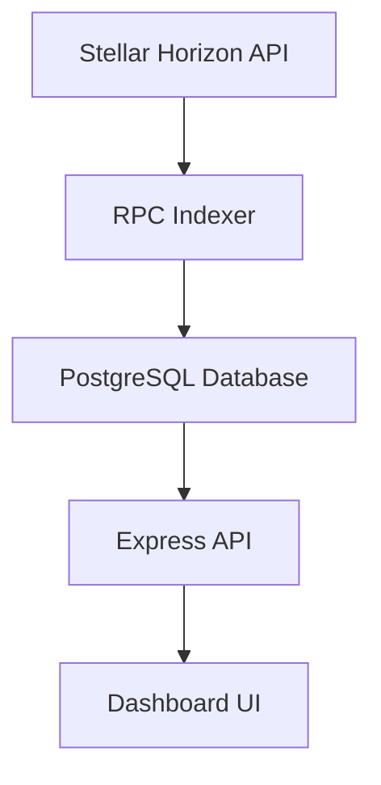

# Backend Architecture

## Data Flow Overview

## Explanation

1. The RPC Indexer fetches vesting-related data from the Stellar Horizon API.
2. The RPC Indexer processes and stores the data in the PostgreSQL database.
3. The Express API reads data from the PostgreSQL database.
4. The Dashboard UI consumes data from the Express API.
